

  
   
  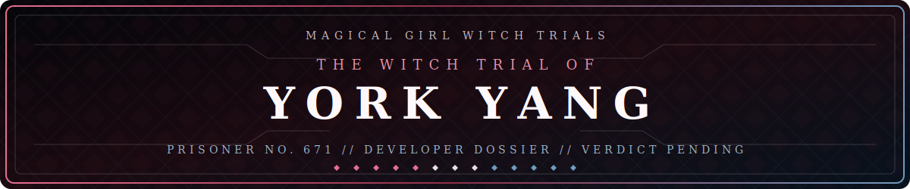
   
  “A witch trial will now commence.”

 

  <a href="https://manosaba.com/" title="Prisoner No. 658 — Ema Sakuraba">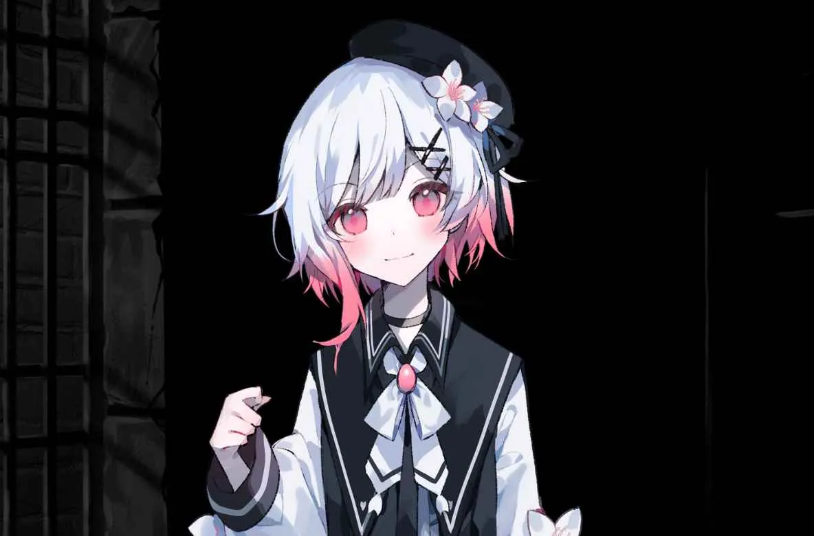</a>
  <a href="https://manosaba.com/" title="Prisoner No. 659 — Hiro Nikaido">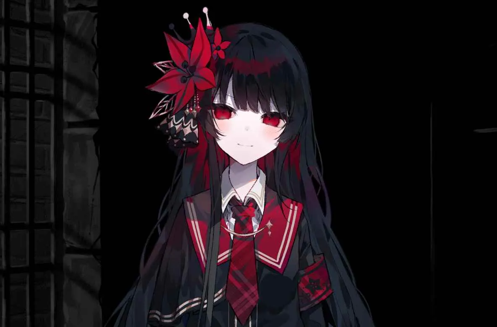</a>
  

 

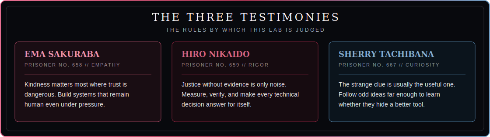

<h2 align="center">01 // THE PRISON MANOR</h2>

A WITCH CANDIDATE'S RECORD, KEPT BY THE OWL WARDEN

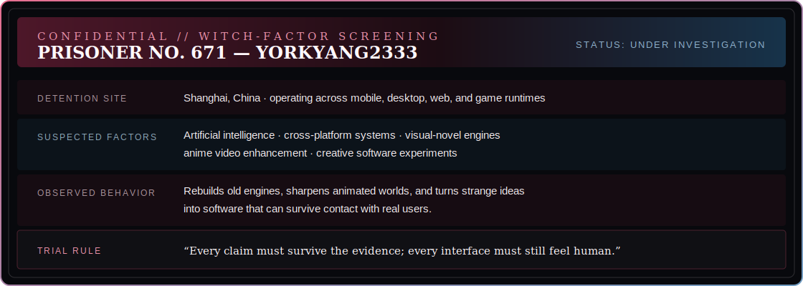

The file was already open when Ema reached the desk. She did not touch it at first. What if it belonged to someone? What if they came back and found her looking?

> **PRISONER NO. 671 — YORKYANG2333** 
> **STATUS: UNDER INVESTIGATION**

“Um... Hiro-chan? Sherry-chan?” Ema kept her voice light. “It is okay to look at this, right? I mean, it was left open, but still...”

Hiro inspected the seal, the desk, and the empty corridor beyond it. “It has been placed here for us. Leaving a prisoner record unattended would be irresponsible otherwise.” She squared the page with the edge of the desk. “We will examine it properly.”

“Oh! Four evidence markers!” Sherry was already on her knees, beaming as she gathered them into her arms. “A music client, an old visual-novel engine, anime enhancement, campus vision... What a wonderfully untidy mystery. Sherry is very interested.”

The owl above them opened one eye.

**“Determine the magic hidden in this record. The investigation begins now.”**

<h2 align="center">02 // THE MAGIC WITHIN</h2>

EVERY CANDIDATE HAS A HIDDEN MAGIC; EVERY MAKER HAS A CRAFT

Nine marks lit up across the record: **Python**, **Kotlin**, **JavaScript**, **TypeScript**, **Vue**, **Swift**, **Rust**, **C++**, and **Ren'Py**.

“Nine kinds of magic?” Ema counted them twice. “That seems... like a lot. Sorry. It is probably not magic at all.”

“Languages,” Hiro said. “Tools. Do not turn an observation into a conclusion, Ema. That would not be correct.”

Sherry hummed as she traced the marks with one finger. “Then the question is not what they are, but why Prisoner 671 keeps picking a new one. A person who collects clues is always more interesting than the clues themselves, isn't that right?”

Ema drew her hands together. “Maybe they do not know the answer yet either. We should not decide who they are just from a list.”

Hiro gave a small nod. “That is correct. We need the work itself.”

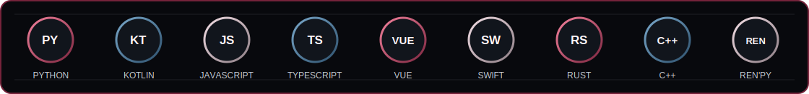

<h2 align="center">03 // THE INVESTIGATION</h2>

SEARCH THE MANOR · FOLLOW THE THREADS · LEARN WHAT THEY CONNECT

“We divide the files, record every claim, and compare our findings before reaching a verdict,” Hiro said. “That is the fairest way to proceed.”

“A proper investigation!” Sherry clapped once. “Wonderful. I shall take the strangest ones. Please do not start without me if you discover a secret passage.”

“There is no secret passage,” Hiro said.

“Not yet.” Sherry smiled even wider.

“Okay! Then Boku will take this one,” Ema said, a little too quickly. She took the file about music carried onto a tiny watch because someone, somewhere, had wanted it close enough to use. Hiro checked the machinery underneath—runtimes, native extensions, exports, and whether the claims survived contact with the code. Sherry took the least related clues and kept returning with another question before either of them had finished answering the last.

  <a href="https://github.com/yorkyang2333/ClaudWecho">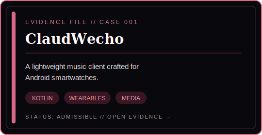</a>
  <a href="https://github.com/AetherKiri/AetherKiri">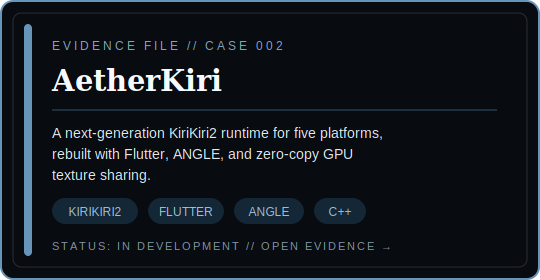</a>
   
  <a href="https://github.com/yorkyang2333/iina-anime4k">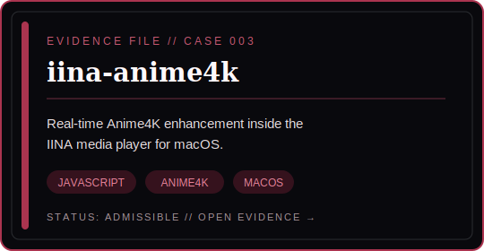</a>
  <a href="https://github.com/yorkyang2333/illegal-parking-detection-webui">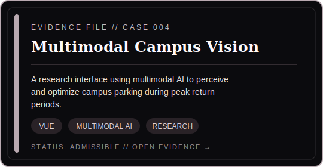</a>

When they met again, Hiro had arranged the four files in a straight line. Sherry had added a fifth object: a bent paper clip she had found on the floor.

“The paper clip is not evidence,” Hiro said.

“It could be!” Sherry replied brightly. “It has a mysterious bend.”

Hiro set it aside, carefully. “Different platforms. Different languages. Different problems. There is no single technique connecting them. We cannot invent a pattern because we want one.”

“But there is a habit,” Sherry said, untroubled. “A visual novel is stranded in an aging runtime, an enhancement filter is stranded outside the player, an idea is stranded without an interface—and Prisoner 671 builds each one a way across. That is much more exciting than a paper clip.”

Ema looked from the files to Hiro. “I think... I think Sherry-chan might be onto something. Not that it proves everything. But if someone made these things so they could reach people, that matters, doesn't it?”

Hiro was quiet for a moment. “It may matter. It is not evidence yet.” She tapped the last unopened section of the record. “Fortunately, we still have evidence.”

<h2 align="center">04 // THE DAILY RECORD</h2>

THE OWL WARDEN'S LEDGER, REFRESHED AFTER MIDNIGHT

  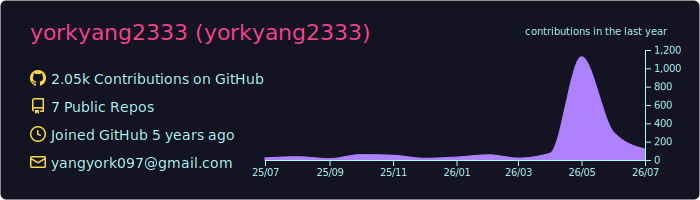
   
  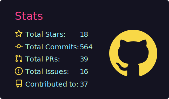
  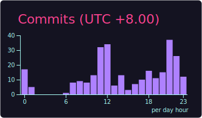
   
  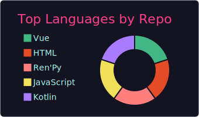
  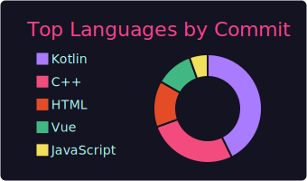

At midnight, the ledger changed by itself, just as it did every night in the manor.

New activity appeared. Languages shifted. Another late hour was added to the record.

Hiro studied the new entries. “The record refreshes itself. No testimony, no flattering interpretation—only what was actually done. This is useful.”

“It is a very diligent diary,” Sherry said, smiling at the shifting lines. “A little shy, perhaps. It says everything except the interesting part.”

“But a ledger can only tell us what was done,” Ema said. She glanced at the other two before continuing. “Not why. And... if we decide why without asking, that would be lonely for them.”

For once, Hiro did not correct her. “Then we will state only what the evidence supports.”

The owl's wings struck the air. Not a command this time—a warning bell from somewhere below.

Then came the scream.

Another prisoner had been found dead in the records room. The four case files lay open around the body. The manor was sealed, the candidates were gathered, and the evidence they had just read was no longer a profile to be discussed. It was a possible motive.

Only after the scene had been searched, the testimonies collected, and the clues compared would the owl call for a trial.

<h2 align="center">05 // THE VERDICT</h2>

NO WITCH NEEDS TO BE FOUND HERE—ONLY WORK WORTH SHARING

The court assembled only after the murder investigation was complete.

Hiro spoke first. “The evidence supports no single magic. It supports a method: choose the tool the problem demands, verify the result, and leave the work open for inspection. That is a conclusion we can defend.”

“And a motive!” Sherry added before the echo had faded. “Curiosity. The good sort—the sort that sees a peculiar problem and follows it until it becomes useful. The dangerous sort is more fun, but that is not in the record today.”

Ema shrank a little when the court turned to her. Then she saw the four files between them and stepped closer instead.

“I do not know what to call it,” she admitted. “But all four cases started the same way. Something that should have been possible was not—so Prisoner 671 tried to make it possible. And if they are still making things, I hope they do not have to do it alone.”

The owl studied the record. Then the seal came down.

**Not a confession. An invitation.** Bring a case involving AI, creative software, visual-novel technology, anime media, or a strange cross-platform idea worth investigating.

  
  
  
  

 

  <i>The manor remains mysterious. The work remains open.</i>
    
  
    This is an unofficial, fan-made profile theme with no affiliation to the rights holders. 
    <i>Magical Girl Witch Trials</i>, its characters, and game artwork belong to their respective rights holders. 
    Character material references the <a href="https://manosaba.com/">official game website</a>. 
    © 2024 Re,AER LLC. / Acacia.
  

