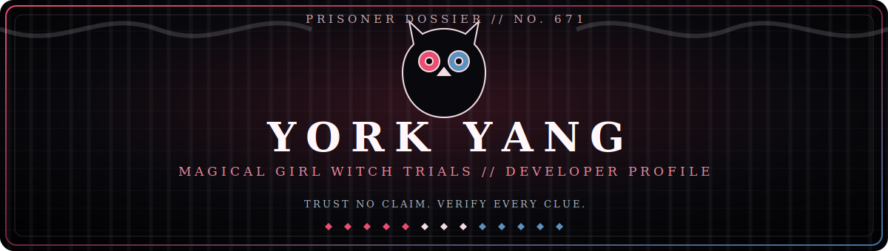

  

 

  
  
  

  <b>NO. 658 — EMA SAKURABA</b> &nbsp;✦&nbsp; <b>NO. 659 — HIRO NIKAIDO</b> &nbsp;✦&nbsp; <b>NO. 667 — SHERRY TACHIBANA</b>

## 01 // PRISONER RECORD

> **“There is a girl among you who has become a witch.”** 
> Thirteen candidates. One isolated prison manor. Every claim is evidence—and every contradiction can become a verdict.

**Prisoner No. 671: York Yang** 
AI investigator, cross-platform builder, and visual-novel enthusiast based in Shanghai.

- 🔮 I explore **AI systems**, creative tools, and multimodal experiences.
- 🕯️ I build across **mobile, desktop, web, and visual-novel engines**.
- 🔍 I am especially interested in **anime video technology**, polished media apps, and unusual software experiments.
- ⚖️ I am open to collaboration when a case is interesting enough to put on trial.

## 02 // WITCH FACTOR ANALYSIS

  
   
  Python · Kotlin · JavaScript · TypeScript · Vue · Swift · Rust · C++ · Ren'Py

 

  

## 03 // EVIDENCE ARCHIVE

<table>
  <tr>
    <td width="50%" valign="top">
      <h3>CASE 001 — ClaudWecho</h3>
      
A lightweight music client crafted for Android smartwatches.

      
<a href="https://github.com/yorkyang2333/ClaudWecho"><b>Examine the evidence →</b></a>

      <code>Kotlin</code> <code>Wearables</code> <code>Media</code>
    </td>
    <td width="50%" valign="top">
      <h3>CASE 002 — iina-anime4k</h3>
      
An Anime4K enhancement plugin for the IINA media player.

      
<a href="https://github.com/yorkyang2333/iina-anime4k"><b>Examine the evidence →</b></a>

      <code>JavaScript</code> <code>Anime4K</code> <code>macOS</code>
    </td>
  </tr>
  <tr>
    <td width="50%" valign="top">
      <h3>CASE 003 — Multimodal Campus Vision</h3>
      
A web interface for multimodal-AI research into campus parking perception and optimization.

      
<a href="https://github.com/yorkyang2333/illegal-parking-detection-webui"><b>Examine the evidence →</b></a>

      <code>Vue</code> <code>Multimodal AI</code> <code>Research</code>
    </td>
    <td width="50%" valign="top">
      <h3>CASE 004 — Visual Novel Lab</h3>
      
Experiments with Ren'Py, KiriKiri, WebGAL, and the tools behind interactive stories.

      
<a href="https://github.com/yorkyang2333/ddlc-renpy8"><b>Open the lab →</b></a> · <a href="https://github.com/yorkyang2333/webgal-manosaba-terre-EM"><b>Witch Trial editor →</b></a>

      <code>Ren'Py</code> <code>WebGAL</code> <code>Visual Novels</code>
    </td>
  </tr>
</table>

## 04 // THE THREE TESTIMONIES

| Candidate | Public record | What she represents here |
|:--|:--|:--|
| **Ema Sakuraba · No. 658** | Warm, positive, and terrified of being rejected. | **Empathy** — software should still feel human. |
| **Hiro Nikaido · No. 659** | Brilliant, disciplined, and uncompromising toward injustice. | **Rigor** — ideas survive only when the evidence does. |
| **Sherry Tachibana · No. 667** | A cheerful self-proclaimed detective with endless curiosity and superhuman strength. | **Curiosity** — inspect every clue, including the strange ones. |

## 05 // ESTABLISH CONTACT

  
  
  
  

 

  <i>The investigation continues. The verdict belongs to the code.</i>
    
  
    This is an unofficial, fan-made profile theme. Character artwork and <i>Magical Girl Witch Trials</i> belong to their respective rights holders. 
    Artwork sourced from the <a href="https://manosaba.com/">official website</a>. © 2024 Re,AER LLC. / Acacia.
  

