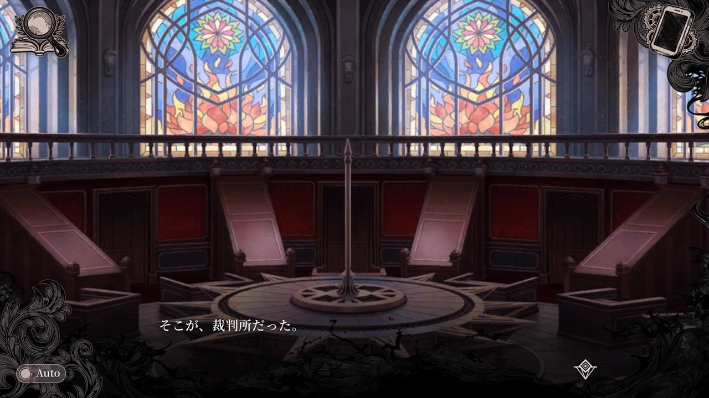

  
   
  
   
  “A witch trial will now commence.”

 

  
  
  

 

<h2 align="center">01 // DETENTION RECORD</h2>

THE PRISON MANOR RECORDS A NEW WITCH CANDIDATE

In the prison manor, each girl is judged by the magic hidden inside her. In this dossier, every repository is judged the same way: by the evidence it leaves behind. My suspected “witch factors” are **AI systems, cross-platform runtimes, visual-novel technology, anime media, and creative software**—all developed under the three testimonies above: Ema's empathy, Hiro's rigor, and Sherry's dangerous curiosity.

<h2 align="center">02 // WITCH-FACTOR AWAKENING</h2>

HARD PROBLEMS REVEAL WHICH MAGIC ANSWERS THE CALL

Strong pressure awakens magic in a witch candidate. A difficult engineering problem awakens a toolchain: Python for intelligence, Kotlin and Swift for native experiences, JavaScript and Vue for interfaces, Rust and C++ for performance, and Ren'Py or KiriKiri when the evidence leads back to a visual novel.

<h2 align="center">03 // THE INVESTIGATION</h2>

SEARCH THE MANOR · QUESTION THE TESTIMONY · ENTER THE EVIDENCE

Before a verdict can be reached, the manor must be searched. These four repositories are the evidence currently admitted to court—each one connecting my developer profile to the investigation, deduction, and magical machinery of *Magical Girl Witch Trials*.

  
  
   
  
  

<h2 align="center">04 // SURVEILLANCE RECORD</h2>

THE PRISON MANOR NEVER STOPS OBSERVING

  
   
  
  
   
  
  

These records are regenerated every six hours by the repository's **Profile Stats Synchronization** workflow, using Shanghai time for the productive-hours report. No testimony is accepted without a trace; no public contribution escapes the archive.

<h2 align="center">05 // THE WITCH TRIAL</h2>

ALL EVIDENCE HAS BEEN HEARD — THE COURT MAY NOW DELIBERATE

  
  
  
  

 

  <i>The investigation continues. The verdict belongs to the code.</i>
    
  
    This is an unofficial, fan-made profile theme with no affiliation to the rights holders. 
    <i>Magical Girl Witch Trials</i>, its characters, and game artwork belong to their respective rights holders. 
    Character material references the <a href="https://manosaba.com/">official game website</a>; courtroom imagery comes from <a href="https://www.nintendo.com/jp/topics/article/b09a8af4-3998-46c1-89f3-0caa82dd5743">Nintendo's official feature</a>. 
    © 2024 Re,AER LLC. / Acacia.
  

