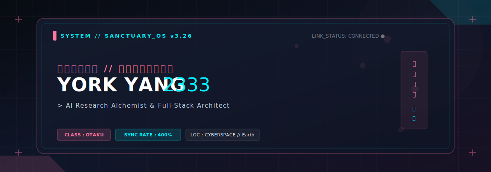
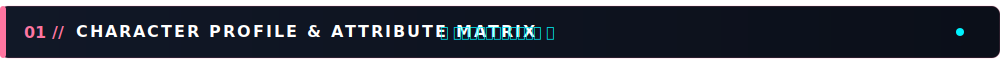
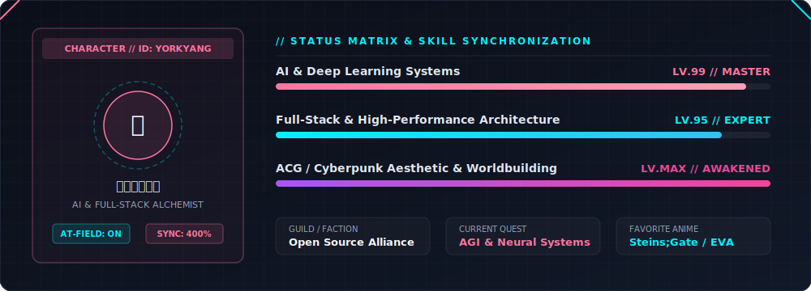
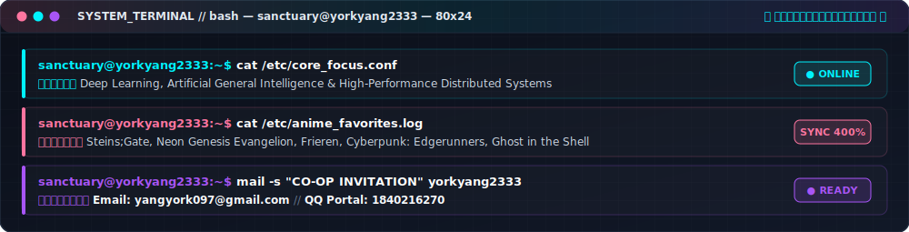
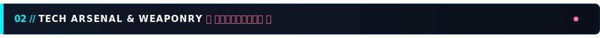
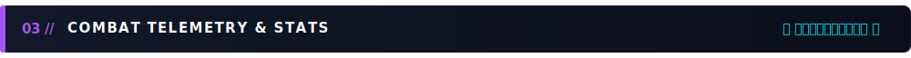
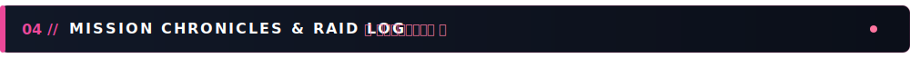

<!-- 00. CYBER-SAKURA HUD HEADER BANNER -->

 

<!-- SYSTEM STATUS BADGES -->

 

<!-- DYNAMIC DAILY ANIME QUOTE -->

 

---

<!-- 01. CHARACTER PROFILE & ATTRIBUTE MATRIX -->

  

 

  

 

  

 

---

<!-- 02. TECH ARSENAL & WEAPONRY -->

  

 

<table>
  <tr>
    <td align="center" width="33%" bgcolor="#0B0F19" style="border: 1px solid #1E293B; padding: 18px;">
      <h4 style="color: #FF75A0; margin-bottom: 12px;">★ CORE // AI &amp; ALGORITHMS</h4>
      
      
Python / C++ / Linux / Docker

    </td>
    <td align="center" width="34%" bgcolor="#0B0F19" style="border: 1px solid #1E293B; padding: 18px;">
      <h4 style="color: #00F2FE; margin-bottom: 12px;">★ SYNCHRONIZE // WEB &amp; FRONTEND</h4>
      
      
TypeScript / React / Modern Web UI

    </td>
    <td align="center" width="33%" bgcolor="#0B0F19" style="border: 1px solid #1E293B; padding: 18px;">
      <h4 style="color: #A855F7; margin-bottom: 12px;">★ INFRA // TOOLS &amp; WORKFLOW</h4>
      
      
Node.js / Git / GitHub / VSCode

    </td>
  </tr>
</table>

 

---

<!-- 03. COMBAT TELEMETRY & STATS -->

  

 

<table>
  <tr>
    <td align="center" valign="top" bgcolor="#0B0F19" style="border: 1px solid #1E293B; border-radius: 12px; padding: 8px;">
      
    </td>
    <td align="center" valign="top" bgcolor="#0B0F19" style="border: 1px solid #1E293B; border-radius: 12px; padding: 8px;">
      
    </td>
  </tr>
</table>

 

 

---

<!-- 04. MISSION CHRONICLES & RAID LOG -->

  

 

<!-- Cyber Snake Contribution Animation -->
<picture>
  <source media="(prefers-color-scheme: dark)" srcset="https://raw.githubusercontent.com/yorkyang2333/yorkyang2333/output/github-contribution-grid-snake-dark.svg">
  <source media="(prefers-color-scheme: light)" srcset="https://raw.githubusercontent.com/yorkyang2333/yorkyang2333/output/github-contribution-grid-snake.svg">
  
</picture>

  

<table>
  <tr>
    <td align="center" bgcolor="#0B0F19" style="padding: 14px 28px; border: 1px solid #1E293B; border-radius: 8px;">
      <code>★ SYSTEM_TERMINATED // DESIGNED WITH CYBER-SAKURA HUD AESTHETIC FOR YORKYANG2333 ★</code>
    </td>
  </tr>
</table>

